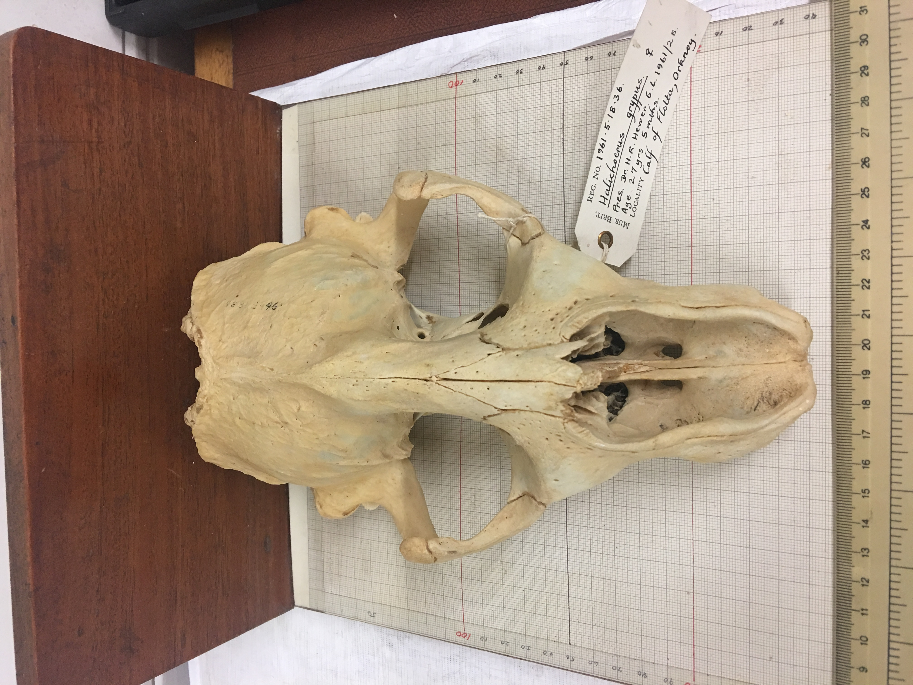
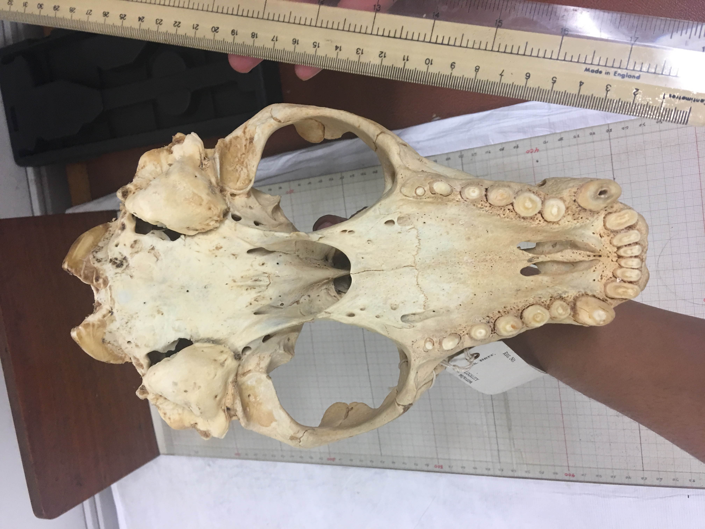
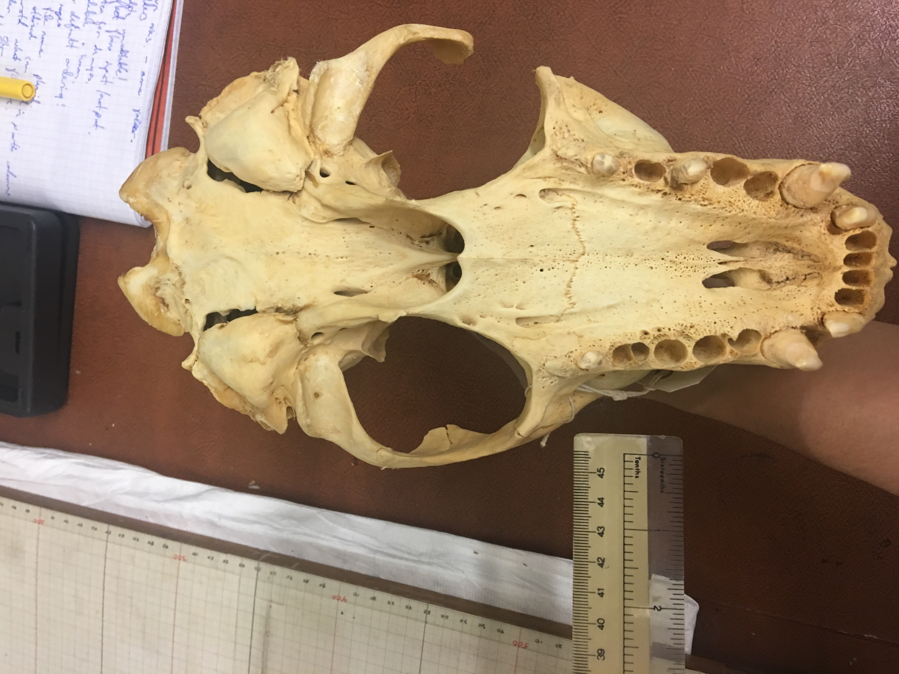

```{r setup, include=FALSE, echo = FALSE, message = FALSE, warning = FALSE}
knitr::opts_chunk$set(echo = FALSE, message = FALSE, warning = FALSE, include = FALSE)
```

```{r echo=FALSE}
library(dplyr)
library(tidyverse)
library(ggmap)
library(ggplot2)
```

## Introduction

Task: Seal Skull Measurements

Curator: Dr Richard Sabin, Collections Manager-Vertebrates, LS Division

This repository contains data and scripts for the analysis of skull measurements from a collection of seal skulls in the Natural History Museum, London.  The raw data contain measurements of condylobasal length, zygomatic width and palatal length for 23 individuals of the species Halichoerus grypus (grey seal) collected in the British Isles.  Twenty-three of the specimens were presented to the museum by Dr. H. R. Hewer (General Letter 1961/28) and two were presented by Dr. R. M. Laws. The seal skulls which were from various places in Scotland. Some of the seals had been culled.

```{r, include=TRUE}
list.files()
```
```{r include=FALSE}
GB <- get_map(location = "Glasgow", source = "google",maptype = "satellite", zoom = 5)
ggmap(GB)
```

```{r include=TRUE}
ggmap(GB)+
  scale_x_continuous(limits = c(-10,6))+
  scale_y_continuous(limits = c(48,60))+
  geom_point(aes(x = -5.8264, y = 59.1215, label = "North Rona"), colour = "red", size = 5)+
  geom_point(aes(x = -2.9605, y = 58.9809, label = "Orkney"), colour = "red", size = 5)+
  geom_point(aes(x = -2.83, y = 59.13, label = "Muckle Green holm"), colour = "red", size = 5)+
    geom_text(aes(x = -5.8264, y = 59.1215, label = "North Rona"), nudge_y = 0.6, nudge_x = -2,  colour = "red", size = 5)+
  geom_text(aes(x = -2.9605, y = 58.9809, label = "Orkney"), nudge_y = -0.4, colour = "red", size = 5)+
  geom_text(aes(x = -2.83, y = 59.13, label = "Muckle Green holm"), nudge_x = 4, nudge_y = 0.6, colour = "red", size = 5)+
  geom_point(aes(x = -2.76666, y = 56.4352, label = "Abertay Sands"), colour = "red", size = 5)+
  geom_text(aes(x = -2.76666, y = 56.4352, label = "Abertay Sands"), nudge_x = -2, nudge_y = -0.4, colour = "red", size = 5)+
  geom_point(aes(x = -2.126, y = 57.047, label = "Downies"), colour = "red", size = 5)+
  geom_text(aes(x = -2.76666, y = 57.047, label = "Downies"), nudge_y = 0.6, colour = "red", size = 5)+
 geom_point(aes(x = -0.153, y = 51.535, label = "London Zoo"), colour = "red", size = 5)+
  geom_text(aes(x = -0.153, y = 51.535, label = "London Zoo"), nudge_y = -0.4, colour = "red", size = 5)+
  geom_point(aes(x = -2.437, y = 56.702, label = "Montrose"), colour = "red", size = 5)+
  geom_text(aes(x = -2.437, y = 56.702, label = "Montrose"), nudge_x = 3.1, colour = "red", size = 5)+
  geom_point(aes(x = -0.614, y = 54.493, label = "Whitby"), colour = "red", size = 5)+
  geom_text(aes(x = -0.614, y = 54.493, label = "Whitby"), nudge_y = -0.7, colour = "red", size = 5)
```
```{r out.width='75%', include=TRUE}
knitr::include_graphics('IMG_3698.JPG')
```

```{r out.width='100%', include=TRUE}

```

```{r out.width='100%', include=TRUE}

```

```{r out.width='100%', include=TRUE}

```
From looking at the tags attached to each specimen, we agreed to collect the following raw data and took it in turns to measure the skulls as selected by Richard:

```{r echo=FALSE}
cleandata <- read_csv("seal_skulls_clean.csv")
```

```{r echo=FALSE}
rawdata <- read_csv("2017-05-15_Seal_Skull_raw.csv")
```

```{r include=TRUE}
tbl_df(rawdata)
```

```{r out.width='100%', include=TRUE}
knitr::include_graphics("2017-05-15_Photos_H.grypus/2017-05-15_H.grypus_1961.1.23.02/20170515_153529_HDR.JPG")
```


As a back up, we wrote down each measurement:

```{r out.width='75%', include=TRUE}
knitr::include_graphics('2017-05-15_Seal_Skull_Measurements-written.JPG')
```


## Data Processing: Clean Data

The file clean_seal_skulls.R in the git repository takes the raw data and outputs a clean version (the file seal_skulls_clean.csv), which is used in all analyses.

```{r include=TRUE}
head(cleandata)
```


## Data Processing: Metadata

```{r echo=FALSE}
metadatashell <- read_csv("seal_skulls_metadata_shell.csv")
metadata <- read_csv("seal_skulls_metadata.csv")
```

```{r include=TRUE}
#head(metadatashell)
head(metadata)
```

## Data Analysis
```{r include=TRUE}
#list.files()
#getwd()

data <- read.csv("seal_clean.csv")

head(data)
names(data)
plot(data)

###### all on same plot
ggplot(data, aes(x = age_months))+
geom_point(aes(y = ZW), colour = "steelblue", size = 3)+
geom_point(aes(y = PL), colour = "darkgreen", size = 3)+
geom_point(aes(y = CBL), colour = "deeppink", size = 3)+
xlab(label = "age months") + 
ylab(label = "length")
```

MEAN and RANGE - AGE - Female

```{r include=TRUE}

mean(data$age_months[data$Sex == "Female"])
range(data$age_months[data$Sex == "Female"])
```

MEAN and RANGE - AGE - Male

```{r include=TRUE}
mean(data$age_months[data$Sex == "Male"])
range(data$age_months[data$Sex == "Male"])
```

```{r include=TRUE}

ggplot(data, aes(age_months, ZW, colour = Sex)) +
  geom_point( size = 3)

mean(data$ZW[data$Sex == "Female"])
mean(data$ZW[data$Sex == "Male"])

ggplot(data, aes(age_months, CBL, colour = Sex)) +
  geom_point( size = 3)

mean(data$CBL[data$Sex == "Female"])
mean(data$CBL[data$Sex == "Male"])

ggplot(data, aes(age_months, PL, colour = Sex)) +
  geom_point( size = 3)

mean(data$PL[data$Sex == "Female"])
mean(data$PL[data$Sex == "Male"])
```


```{r include=TRUE}
####### do a linear regression model and add trendline -- 

###### first change datasheed to length in 1 column
test <-
  data %>%
  gather(l_type, length, CBL:PL)

######### log length
test1 <- 
  test %>%
  #mutate(length, log(length)) %>%
  mutate(age_months, "ln_age" = log(age_months))

#test1 %>%
##rename(test1, "(log(length)" =  "lg_ln") ####### not working
#names(test1)[names(test1)=="log(length)"] <- "lg_ln"

##### do linear regression model
model1 <- lm(length ~ ln_age, data = test1)
#model1 <- lm(age_months ~ lg_ln, data = test1) ### which way round!!
######## check assumptions in ggfortify
plot(model1)
#########stats
anova(model1)
summary(model1)

########### add trendline and CI's
newX <- expand.grid(age_months = seq(from = 0.25, to = 6, length = 100))
head(newX)
names(newX) <- "ln_age"

newY <- predict(model1, newdata = newX, interval = "confidence")
addThese <- data.frame(newX, newY)
addThese <- rename(addThese, length = fit)


ggplot(test1, aes(x = ln_age, y = length)) + 
  geom_point(col = "cornflowerblue", size = 3) +
  labs(x = "age", y = "length") +
  theme_bw() +
  geom_smooth(data = addThese, aes(ymin = lwr, ymax = upr), stat = "identity")
```

##CBL Only
```{r include=TRUE}

####### do a linear regression model and add trendline -- 

######### log length
test_C <- 
  data %>%
  #mutate(length, log(length)) %>%
  mutate(age_months, "ln_age" = log(age_months))

#test1 %>%
##rename(test1, "(log(length)" =  "lg_ln") ####### not working
#names(test1)[names(test1)=="log(length)"] <- "lg_ln"

##### do linear regression model
model1 <- lm(CBL ~ ln_age, data = test_C)
#model1 <- lm(age_months ~ lg_ln, data = test1) ### which way round!!
######## check assumptions in ggfortify


########### add trendline and CI's
newX <- expand.grid(age_months = seq(from = 0.25, to = 6, length = 100))
head(newX)
names(newX) <- "ln_age"

newY <- predict(model1, newdata = newX, interval = "confidence")
addThese <- data.frame(newX, newY)
addThese <- rename(addThese, CBL = fit)


ggplot(test_C, aes(x = ln_age, y = CBL)) + 
  geom_point(col = "cornflowerblue", size = 3) +
  labs(x = "age", y = "CBL") +
  theme_bw() +
  geom_smooth(data = addThese, aes(ymin = lwr, ymax = upr), stat = "identity")
```


##ZW Only
```{r include=TRUE}


####### do a linear regression model and add trendline -- 

######### log length
test_Z <- 
  data %>%
  #mutate(length, log(length)) %>%
  mutate(age_months, "ln_age" = log(age_months))

#test1 %>%
##rename(test1, "(log(length)" =  "lg_ln") ####### not working
#names(test1)[names(test1)=="log(length)"] <- "lg_ln"

##### do linear regression model
model1 <- lm(ZW ~ ln_age, data = test_Z)
#model1 <- lm(age_months ~ lg_ln, data = test1) ### which way round!!
######## check assumptions in ggfortify


########### add trendline and CI's
newX <- expand.grid(age_months = seq(from = 0.25, to = 6, length = 100))
head(newX)
names(newX) <- "ln_age"

newY <- predict(model1, newdata = newX, interval = "confidence")
addThese <- data.frame(newX, newY)
addThese <- rename(addThese, ZW = fit)

ggplot(test_Z, aes(x = ln_age, y = ZW)) + 
  geom_point(col = "cornflowerblue", size = 3) +
  labs(x = "age", y = "ZW") +
  theme_bw() +
  geom_smooth(data = addThese, aes(ymin = lwr, ymax = upr), stat = "identity")
```

##PL Only
```{r include=TRUE}

####### do a linear regression model and add trendline -- 

######### log length
test_P <- 
  data %>%
  #mutate(length, log(length)) %>%
  mutate(age_months, "ln_age" = log(age_months))

#test1 %>%
##rename(test1, "(log(length)" =  "lg_ln") ####### not working
#names(test1)[names(test1)=="log(length)"] <- "lg_ln"

##### do linear regression model
model1 <- lm(PL ~ ln_age, data = test_P)
#model1 <- lm(age_months ~ lg_ln, data = test1) ### which way round!!
######## check assumptions in ggfortify

########### add trendline and CI's
newX <- expand.grid(age_months = seq(from = 0.25, to = 6, length = 100))
head(newX)
names(newX) <- "ln_age"

newY <- predict(model1, newdata = newX, interval = "confidence")
addThese <- data.frame(newX, newY)
addThese <- rename(addThese, PL = fit)

ggplot(test_P, aes(x = ln_age, y = PL)) + 
  geom_point(col = "cornflowerblue", size = 3) +
  labs(x = "age", y = "PL") +
  theme_bw() +
  geom_smooth(data = addThese, aes(ymin = lwr, ymax = upr), stat = "identity")
```


