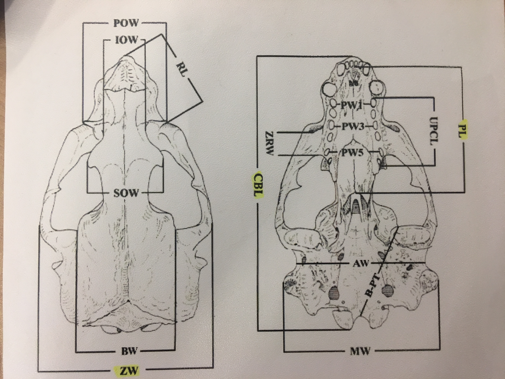
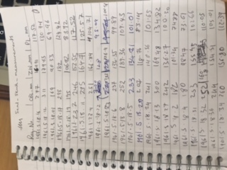

```{r setup, include=FALSE, echo = FALSE, message = FALSE, warning = FALSE}
knitr::opts_chunk$set(echo = FALSE, message = FALSE, warning = FALSE, include = FALSE)
```

```{r echo=FALSE}
library(dplyr)
library(tidyverse)
```

## Introduction

Task: Seal Skull Measurements

Curator: Dr Richard Sabin, Collections Manager-Vertebrates, LS Division

This repository contains data and scripts for the analysis of skull measurements from a collection of seal skulls in the Natural History Museum, London.  The raw data contain measurements of condylobasal length, zygomatic width and palatal length for 23 individuals of the species Halichoerus grypus (grey seal) collected in the British Isles.  Twenty-three of the specimens were presented to the museum by Dr. H. R. Hewer (General Letter 1961/28) and two were presented by Dr. R. M. Laws. The seal skulls which were from various places in Scotland. Some of the seals had been culled.

```{r, include=TRUE}
list.files()
```

```{r out.width='75%', include=TRUE}

```

From looking at the tags attached to each specimen, we agreed to collect the following raw data and took it in turns to measure the skulls as selected by Richard:

```{r echo=FALSE}
cleandata <- read_csv("seal_skulls_clean.csv")
```

```{r echo=FALSE}
rawdata <- read_csv("2017-05-15_Seal_Skull_raw.csv")
```

```{r include=TRUE}
tbl_df(rawdata)
```

As a back up, we wrote down each measurement:

```{r out.width='75%', include=TRUE}

```

```{r out.width='100%', include=TRUE}
knitr::include_graphics("2017-05-15_Photos_H.grypus/20170515_153537_HDR.jpg")
```

## Data Processing: Clean Data

The file clean_seal_skulls.R in the git repository takes the raw data and outputs a clean version (the file seal_skulls_clean.csv), which is used in all analyses.

```{r include=TRUE}
head(cleandata)
```


## Data Processing: Metadata

```{r echo=FALSE}
metadatashell <- read_csv("seal_skulls_metadata_shell.csv")
metadata <- read_csv("seal_skulls_metadata.csv")
```

```{r include=TRUE}
head(metadatashell)
head(metadata)
```

## Data Analysis

